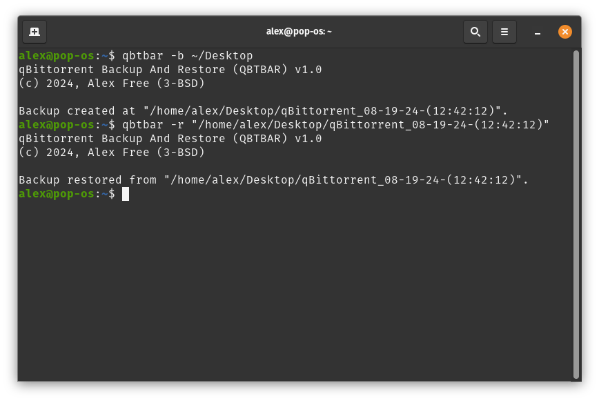

# qBittorrent Backup And Restore (QBTBAR)

_By Alex Free_.

Transfer all of your current [qBittorrent](https://www.qbittorrent.org/) data to a different computer or new OS installation.

| [Homepage](https://alex-free.github.io/qbtbar) | [Github](https://github.com/alex-free/qbittorrent-backup-and-restore) |

## Table Of Contents

* [Downloads](#downloads)
* [Usage](#usage)
* [License](#license)
* [Building](build.md)

## Downloads

### Version 1.0.1 (9/16/2024)

Changes:

* Fixed restore mode, and improved overall code.

---------------------------------------

* [qbtbar-v1.0.1.zip](https://github.com/alex-free/qbittorrent-backup-and-restore/releases/download/v1.0.1/qbtbar-v1.0.1.zip) _Portable Release for Linux._

* [qbtbar-v1.0.1.deb](https://github.com/alex-free/qbittorrent-backup-and-restore/releases/download/v1.0.1/qbtbar-v1.0.1.deb) _Deb package file for Linux._

---------------------------------------

[Previous versions](changelog.md)

## Usage

`Usage: qbtbar <mode> <directory>`

`<mode>:`

`-b	Create a backup.`

`-r	Restore a backup.`

`<directory>	For backup mode, this specifies the parent directory to generate the backup into (the backup directory name itself is auto-generated). For restore mode this specifies a backup directory previously generated by backup mode.`

---------------------------------------

Execute `./program <mode> <directory` found in the portable release using a Terminal application. Alternatively if you have install the `.deb` package file `qbtbar` will be available as a global user command to the system, so just `qbtbar <mode> <directory` works fine.

Notes:

* If you use external drives to store any torrents, please make sure they have the same mount point as when the backup was originally taken. 
* It is always best practice to make sure any external drives containing torrents are mounted in the OS before starting qBittorrent.

## License

qBittorrent Backup And Restore (QBTBAR) is released as open source software under the [3-BSD license](license.md).

